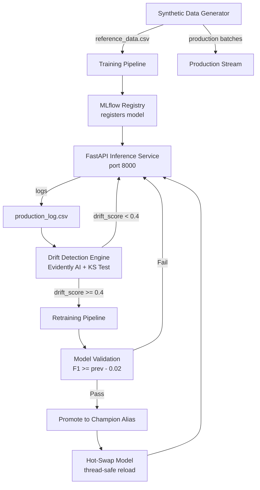
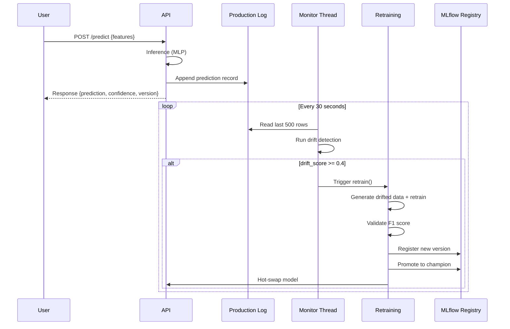

# ModelReviver

> Self-Healing MLOps Platform for Automated Model Monitoring, Drift Detection, Retraining, and Redeployment.


---

## Overview

ModelReviver is an end-to-end MLOps platform designed to automatically maintain machine learning model performance in production.

Traditional ML systems become less accurate as real-world data evolves. This phenomenon, known as **data drift** or **concept drift**, causes prediction quality to degrade over time.

ModelReviver continuously monitors deployed models, detects drift, retrains models using fresh data, validates performance, and redeploys improved versions automatically.

The goal is to create a **self-healing machine learning lifecycle**.

---

## Problem Statement

Most machine learning projects stop after deployment.

```text
Train Model
     ↓
Deploy
     ↓
Forget
```

Over time:

- Customer behavior changes
- Market conditions change
- Sensor characteristics change
- Fraud patterns evolve

Result:

- Accuracy drops
- Business value decreases
- Manual intervention becomes necessary

ModelReviver solves this problem by introducing an automated feedback loop.

---

## Core Objective

Develop a closed-loop MLOps platform capable of:

- Monitoring model performance
- Detecting drift
- Triggering retraining
- Validating new models
- Redeploying improved versions

without requiring continuous human intervention.

---

## Architecture



---

## Closed Loop Lifecycle



---

## Quick Start

```bash
# Create and activate virtual environment (Recommended)
python -m venv .venv
.\.venv\Scripts\activate  # On Windows
# source .venv/bin/activate  # On Linux/Mac

# Install dependencies
pip install -r requirements.txt

# Run the platform (bootstraps data, trains initial model, starts API + monitor)
python main.py
```

Once running:

```bash
# Health check
curl http://localhost:8000/health

# Make a prediction
curl -X POST http://localhost:8000/predict \
  -H "Content-Type: application/json" \
  -d '{"features": [0.5, -1.2, 0.3, 2.1, -0.7]}'

# Swagger docs: http://localhost:8000/docs
```

### Simulate Drift

In a separate terminal (with venv activated if needed), run the drift simulator to send predictions with increasing distribution shift:

```bash
python simulate_drift.py
```

The monitor will detect the drift and automatically retrain + redeploy a new model version.

---

## Technology Stack

### Machine Learning Layer

| Component | Technology |
|-----------|-----------|
| Training | PyTorch (MLP) |
| Data Processing | Pandas |
| ML Utilities | Scikit-Learn |
| Experiment Tracking | MLflow |

### Serving Layer

| Component | Technology |
|-----------|-----------|
| API | FastAPI |
| Serialization | Pickle / Joblib |
| Documentation | Swagger UI |

### Monitoring Layer

| Component | Technology |
|-----------|-----------|
| Drift Detection | Evidently AI |
| Data Drift Algorithm | K-S Test / DataDriftPreset |
| Monitoring Loop | Background thread (daemon) |

### Infrastructure Layer

| Component | Technology |
|-----------|-----------|
| Containerization | Docker |
| Version Control | Git |
| Repository | GitHub |

---

## Project Structure

```text
├── main.py                   # Entry point — bootstrap, API, monitor thread
├── config.py                 # Central configuration
├── requirements.txt          # Python dependencies
├── Dockerfile                # Container build
├── docker-compose.yml        # MLflow server + API
├── model_loader.py           # Shared model loading & hot-swapping
├── simulate_drift.py         # Drift simulation helper

├── api/
│   ├── main.py               # FastAPI app — /health, /predict
│   └── schemas.py            # Pydantic request/response models

├── training/
│   ├── train.py              # PyTorch MLP training + MLflow logging
│   └── evaluate.py           # Accuracy / precision / recall / F1

├── monitoring/
│   ├── drift_detector.py     # Evidently AI data drift comparison
│   └── monitor.py            # Background loop — check & trigger retrain

├── retraining/
│   └── retrain.py            # Retrain + validate + promote + hot-swap

└── data/
    └── generator.py          # Synthetic data with controllable drift

# Generated (gitignored): models/, mlruns/, data/*.csv
```

---

## Current Implementation Status

All core components are fully implemented:

| Module | File | Status |
|--------|------|--------|
| Data Generation | `data/generator.py` | ✅ Complete |
| Model Training | `training/train.py` | ✅ Complete |
| Model Evaluation | `training/evaluate.py` | ✅ Complete |
| API Service | `api/main.py` | ✅ Complete |
| Request Schemas | `api/schemas.py` | ✅ Complete |
| Drift Detection | `monitoring/drift_detector.py` | ✅ Complete |
| Background Monitor | `monitoring/monitor.py` | ✅ Complete |
| Retraining Engine | `retraining/retrain.py` | ✅ Complete |
| Model Loader | `model_loader.py` | ✅ Complete |
| Entry Point | `main.py` | ✅ Complete |
| Drift Simulator | `simulate_drift.py` | ✅ Complete |

---

## System Modules

### Synthetic Data Generator (`data/generator.py`)

Generates tabular data with **controllable distribution drift** for reproducible demos. The reference dataset is drawn from N(0, 1), and production batches shift their mean by `drift_step × batch_index`.

### Model Training (`training/train.py`)

Trains a PyTorch MLP (2 hidden layers, ReLU activations) on reference data. Logs hyperparameters and metrics to MLflow. Registers the model in the MLflow Model Registry for version management.

### Prediction Service (`api/main.py`)

FastAPI REST API:

- `GET /health` — service status + active model version
- `POST /predict` — accepts `{"features": [...]}`, returns prediction + confidence + model version
- Logs every request to `production_log.csv` for drift analysis

### Drift Detection (`monitoring/drift_detector.py`)

Uses Evidently AI's `DataDriftPreset` (Kolmogorov–Smirnov test) to compare reference training data distribution against recent production data. Returns a drift score (fraction of drifted features). If the score exceeds the threshold (default 0.4), drift is flagged.

### Monitoring Loop (`monitoring/monitor.py`)

Runs as a daemon thread alongside the API. Every 30 seconds, it reads the last 500 prediction log entries, runs drift detection, and triggers retraining if drift is found.

### Retraining Engine (`retraining/retrain.py`)

When triggered:

1. Generates fresh synthetic data matching the drifted distribution
2. Combines it with original reference data
3. Retrains the PyTorch model
4. Evaluates on holdout — if F1 >= previous F1 - 0.02, accepts the new model
5. Registers the new version in MLflow with the `champion` alias
6. Hot-swaps the API's in-memory model (zero-downtime)

### Model Hot-Swap (`model_loader.py`)

Thread-safe shared module that loads the model from MLflow (by `champion` alias) or falls back to local pickle. Used by both the API and the retraining engine.

---

## Docker Deployment

### With docker-compose (includes MLflow server)

```bash
docker compose up --build
```

### Standalone

```bash
docker build -t modelreviver .
docker run -p 8000:8000 \
  -v $(pwd)/data:/app/data \
  -v $(pwd)/models:/app/models \
  -v $(pwd)/mlruns:/app/mlruns \
  modelreviver
```

Access:

```text
http://localhost:8000        # API
http://localhost:8000/docs   # Swagger UI
http://localhost:5000        # MLflow UI
```

---

## API Reference

### `GET /health`

```json
{ "status": "ok", "model_version": "3" }
```

### `POST /predict`

Request:

```json
{ "features": [0.5, -1.2, 0.3, 2.1, -0.7] }
```

Response:

```json
{ "prediction": 1, "confidence": 0.9999, "model_version": "3" }
```

---

## Success Metrics

| Metric | Measured |
|--------|----------|
| Drift Detection Accuracy | Evidently AI drift score vs injected drift |
| Model Accuracy Improvement | F1 comparison before vs after retraining |
| Retraining Success Rate | % of cycles passing validation gate |
| Deployment Time | Drift detection → new model serving |
| Prediction Latency | p50/p99 inference time |
| System Availability | Health endpoint uptime |

---

## Future Enhancements

- Kubernetes
- Kafka Event Streaming
- Prometheus Monitoring
- Grafana Dashboards
- Multi-Model Support
- Explainable AI
- Cloud Deployment
- Auto Scaling
- Delayed label feedback (ground-truth from production)

---

## License

MIT
