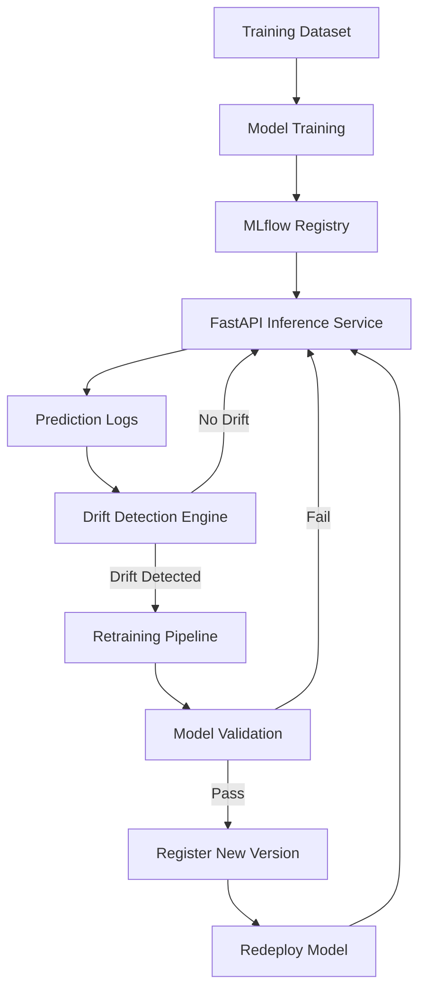
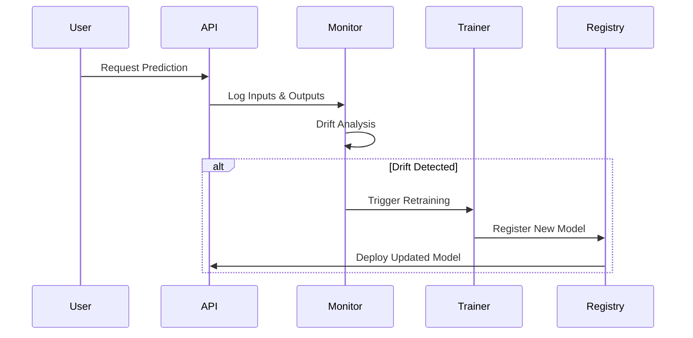
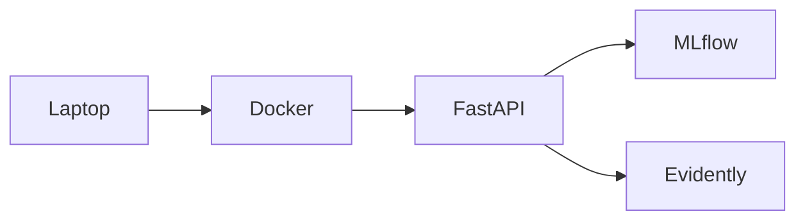

# ModelReviver

> Self-Healing MLOps Platform for Automated Model Monitoring, Drift Detection, Retraining, and Redeployment.


---

## Overview

ModelReviver is an end-to-end MLOps platform designed to automatically maintain machine learning model performance in production.

Traditional ML systems become less accurate as real-world data evolves. This phenomenon, known as **data drift** or **concept drift**, causes prediction quality to degrade over time.

ModelReviver continuously monitors deployed models, detects drift, retrains models using fresh data, validates performance, and redeploys improved versions automatically.

The goal is to create a **self-healing machine learning lifecycle**.

---

## Problem Statement

Most machine learning projects stop after deployment.

```text
Train Model
     ↓
Deploy
     ↓
Forget
```

Over time:

- Customer behavior changes
- Market conditions change
- Sensor characteristics change
- Fraud patterns evolve

Result:

- Accuracy drops
- Business value decreases
- Manual intervention becomes necessary

ModelReviver solves this problem by introducing an automated feedback loop.

---

## Core Objective

Develop a closed-loop MLOps platform capable of:

- Monitoring model performance
- Detecting drift
- Triggering retraining
- Validating new models
- Redeploying improved versions

without requiring continuous human intervention.

---

# Architecture



---

# Closed Loop Lifecycle



---

# Technology Stack

## Machine Learning Layer

| Component | Technology |
|------------|------------|
| Training | PyTorch |
| Data Processing | Pandas |
| ML Utilities | Scikit-Learn |
| Experiment Tracking | MLflow |

---

## Serving Layer

| Component | Technology |
|------------|------------|
| API | FastAPI |
| Serialization | Pickle / Joblib |
| Documentation | Swagger UI |

---

## Monitoring Layer

| Component | Technology |
|------------|------------|
| Drift Detection | Evidently AI |
| Logging | Python Logging |
| Metrics | Custom Monitoring |

---

## Infrastructure Layer

| Component | Technology |
|------------|------------|
| Containerization | Docker |
| Version Control | Git |
| Repository | GitHub |

---

# Project Structure

```text
modelreviver/

├── api/
│   └── main.py
│
├── models/
│   ├── model.pkl
│   └── metadata.json
│
├── training/
│   ├── train.py
│   └── evaluate.py
│
├── monitoring/
│   ├── drift_detector.py
│   └── monitor.py
│
├── retraining/
│   └── retrain.py
│
├── data/
│
├── mlruns/
│
├── Dockerfile
│
├── requirements.txt
│
└── README.md
```

---

# System Modules

## Model Training

Responsibilities:

- Data preprocessing
- Feature engineering
- Model training
- Artifact generation

Outputs:

```text
model.pkl
```

---

## Model Registry

Responsibilities:

- Version control
- Experiment tracking
- Metadata storage

Tool:

MLflow

---

## Prediction Service

Responsibilities:

- Expose REST APIs
- Serve predictions
- Log requests

Tool:

FastAPI

---

## Drift Detection

Responsibilities:

- Compare production data with training data
- Detect statistical drift
- Trigger retraining

Tool:

Evidently AI

---

## Retraining Engine

Responsibilities:

- Train model using updated dataset
- Evaluate performance
- Publish improved versions

---

## Local Deployment



Requirements:

- 8 GB RAM
- Intel i5 / Ryzen 5
- 20 GB free storage

---

# Docker Deployment

## Build Image

```bash
docker build -t modelreviver .
```

## Run Container

```bash
docker run -p 8000:8000 modelreviver
```

Access:

```text
http://localhost:8000
```

Swagger Documentation:

```text
http://localhost:8000/docs
```

---

# Success Metrics

- Drift Detection Accuracy
- Model Accuracy Improvement
- Retraining Success Rate
- Deployment Time
- Prediction Latency
- System Availability

---

# Future Enhancements

- Kubernetes
- Kafka Event Streaming
- Prometheus Monitoring
- Grafana Dashboards
- Multi-Model Support
- Explainable AI
- Cloud Deployment
- Auto Scaling

---
